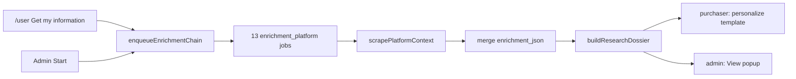

# Admin Contractor Research — product and implementation plan

Source of truth: `origin/main` after **PR #145** (workspace product retired from `/admin`). Spreadsheet: CSLB “Contractor List” CSV export (`Copy of Contractor List (22).xlsx - Contractor List.csv`).

This is one product: admins research contractors from a sheet using the **same Firecrawl enrichment chain** purchasers already run from **Get my information**. It is not a second scraper, not a revived workspace kickoff, and not template fitting.

---

## What an admin should be able to do

1. Open `/admin`, click **Contractor Research**, land on `/admin/contractor-research`.
2. See Chrome-style tabs. **+** starts a new empty tab. Upload a CSV like the attached CSLB export. The tab name defaults to the file name and can be renamed inline.
3. The tab shows the **data table as uploaded** (original columns), plus two extra columns that are not in the file: **Research** and **Comments**.
4. **Comments**: empty at first; click a cell, type a note, it saves for that row.
5. **Research**: **Start** runs Firecrawl for that row. While it runs, the button is a loader. When it finishes, **View** opens a popup of the same research dossier Get my information already produces (photos, listings, ratings, and a **website / social** section). If it fails, **Retry**.
6. Closing the browser and coming back still shows tabs, notes, and research. Another admin session using the same login sees the same sheets.

Purchasers on `/user` keep **Get my information** as scrape → fit template. They do not get this table or popup. The scrape they trigger and the scrape Start triggers are the same chain.

---

## What the attached sheet actually is

Evidence from the uploaded file (not assumed):

- Lines 1–11 are CSLB disclaimer / blank rows, not contractors.
- Header row: `BusinessName, Address, City, State, ZipCode, License, PhoneNumber`.
- **72** data rows. All `State=CA`. Cities are San Francisco in this export. No trade, services, email, or website column.
- Business names may contain commas and are quoted (`"ADL ROOFING SOLUTIONS, INC"`).

**Render “as is”** means: show those seven columns for the 72 people. Do **not** show the disclaimer as table rows. Detect the header by `BusinessName` + `License` (case-insensitive). That is the general case for CSLB list exports, not a one-file special case.

**Identity for Firecrawl** (same fields `scrapePlatformContext` already takes):

| Scrape field | Sheet column |
| --- | --- |
| `businessName` | `BusinessName` |
| `licenseNumber` | `License` |
| `city` | `City` |
| `trade` | absent → `""` |
| `services` | absent → `[]` |

Do **not** infer “Roofing” from this file’s names. A later electrician export would then be wrong. CSLB + name + license + city is enough for the existing search string. Address and phone stay visible on the grid and in the View identity block; they are not extra Firecrawl query terms unless we later find searches failing without them.

**Start** is disabled when `BusinessName` or `License` is blank after trim.

---

## Architectural prior (cursor.md)

Today research is **website-shaped**:

- **Get my information** → `runTemplatePersonalization` → `enqueueEnrichmentChain(websiteId)` → 13 `enrichment_platform` jobs → `scrapePlatformContext` → merge into `contractor_profiles.enrichment_json` → `buildResearchDossier`.
- Jobs: `background_jobs.website_id` **NOT NULL** → `websites`.
- Execute reads identity from `websites.onboarding_state`.
- Cron: `* * * * *`, runner default **one job per tick**. A full chain is ~13 minutes.

PR #145 removed admin kickoff / fake workbench sites. Creating a hidden `websites` row per CSV line would revive that product as an implementation trick. **Do not do that.**

The scrape itself is already identity-shaped (`businessName`, `licenseNumber`, `trade`, `city`, `services`). The mismatch is **persistence and job ownership**, not Firecrawl.

**General case:** an enrichment chain belongs to a **research subject**. Purchaser subjects are websites. Admin subjects are sheet rows. One enqueue, one execute, one dossier. Two callers.

Admin **Start** does **not** run `personalize_template`. Fitting a template requires a purchased site. View is the dossier only.

---

## Persistence (required)

Tabs, notes, and research cannot live only in the browser. Refresh would wipe Firecrawl spend.

New tables (names indicative):

- `contractor_research_sheets`: `id`, `title`, `original_filename`, `headers jsonb` (exact uploaded header strings), `created_at`, `updated_at`.
- `contractor_research_rows`: `id`, `sheet_id`, `sort_index`, `cells jsonb` (header → string), `comment text not null default ''`, `chain_id uuid null`, `research_status text null`, `enrichment_json jsonb not null default '{}'`.

Browser RLS deny; admin server functions use the existing `requireAdminMiddleware` / service role pattern (`src/lib/admin.functions.ts`).

**Jobs:** `background_jobs.website_id` becomes nullable. Add `research_row_id uuid null` referencing `contractor_research_rows`. Check: exactly one of `website_id` / `research_row_id` is set. Site-generation / add-video jobs still require `website_id`. Enrichment cancel/idempotency keys that currently lock on `website_id` must lock on the subject that owns the chain (website **or** row) so **Start** on row A cannot cancel row B, and cannot cancel a purchaser’s site.

`enqueueEnrichmentChain`, `executeEnrichmentPlatformJob`, `mergeEnrichmentPlatformResult`, `finalizeEnrichmentChain`, `mirrorResearchStatus` take a subject:

- website: identity from `onboarding_state`, merge/status on `contractor_profiles` + `websites.research_status` (unchanged purchaser behavior).
- research row: identity from mapped cells, merge/status on the row only. Do **not** write `websites` or `contractor_profiles`.

Media persist (`persistScrapedSiteMedia`) today keys off `website_id` for template overlay. For admin rows, persist images for View under a research prefix **or** show dossier image URLs if overlay persist cannot run without a site. Do not invent a second image pipeline; reuse the existing persist helper with a non-website owner if it already stores bytes by path.

This is a **forward SQL migration**. It does not apply to production until the GitHub PR is merged **and** you explicitly confirm Lovable apply (see `cursor.md` deployment ops). Say so in the implementation PR: apply `supabase/migrations/<name>.sql` in Lovable.

---

## Admin UI (post–PR #145 chrome)

Copy the sibling-page pattern:

- Nav: add `{ title: "Contractor Research", to: "/admin/contractor-research" }` in [`src/components/admin/AdminShell.tsx`](src/components/admin/AdminShell.tsx) next to Home / Agent traces / Observability.
- Route: [`src/routes/admin_.traces.tsx`](src/routes/admin_.traces.tsx) pattern → `src/routes/admin_.contractor-research.tsx`, wrapped in `AdminGate` + `AdminShell`, `NOINDEX_META`.
- Login stays full-screen. Unauthenticated people never see the nav item (nav is inside the gate, same as today).

### Tabs

- Horizontal tabs + **+**.
- New tab: empty state, upload control (CSV only).
- After parse: fill that tab; title = filename (strip `.csv`). Inline rename on the tab label (blur/Enter save).
- Switching tabs does not lose in-flight research (server-owned).
- **Delete tab**: confirm. If any row has an active chain, cancel that chain then delete sheet+rows (FK). Not specified as “close without delete”; treat X as delete because state is durable. Empty unused tab can delete without confirm.
- One upload per tab. Replacing a sheet would destroy research; **new tab** for another file.
- Shared across the single admin login. Last comment write wins. No per-person sheets (there is no admin user table).

### Grid

- Sticky header. Horizontal scroll for seven CSLB columns + Research + Comments.
- Original cell text, not reformatted licenses/phones.
- Research and Comments pinned on the right if the table is wide (nice-to-have, not a second grid).

### Comments

- Always visible textarea/input in the cell. Autosave on blur (and debounce while typing if cheap). Empty string is valid. No markdown. Reasonable max length (e.g. 2000). Failure: keep the typed text and show a small error; do not clear the cell.

### Research column

| State | What the admin sees |
| --- | --- |
| Never started, identity ok | **Start** |
| Missing name or license | Disabled Start, reason on hover |
| Chain `hasActiveWork` | Loader, not a second Start |
| `complete` or `partial` | **View** |
| `failed` / `no_results_found` | **Retry** + still allow **View** if any enrichment exists |
| Reload mid-run | Loader resumes from `chain_id` + job progress (same poll idea as Step 1, 3s) |

**Start / Retry:** `enqueueEnrichmentChain` for that row (cancel that row’s prior enrichment chain only). Poll existing `getJobProgress`-style snapshot keyed by `chainId` (extend the progress helper to accept research-row subjects, or add a thin admin wrapper that reuses `buildJobProgressSnapshot` / `classifyTemplateLookupPoll` without the template-seed/fit steps).

**View:** dialog (not a nested-nav sheet). Content is `buildResearchDossier` — platforms, matched photos, reviews, unmatched hits, **plus a first-class Website & social block** (below). Do not revive `WorkspaceShell` / `ResearchDossierSheet` as a workbench. A dialog on this page is enough.

No “Start all” in v1. Each Start is 13 Firecrawl searches. The global runner is **one job per minute**; many Starts queue behind each other **and** behind live purchaser scrapes. The UI should not pretend a sheet of 72 finishes in one click. Optional later: a quiet note under the table that research shares the same job runner as Get my information (~13 minutes per contractor when the queue is otherwise idle).

---

## Website & social (shared scrape output, not a second crawler)

Facebook and Instagram are **already** platforms 7–8 in `ENRICHMENT_PLATFORMS`. Official website URLs are **already** extracted (`ContractorListingExtract.website`) and classified in `classifyListedWebsitePresence` / `listedWebsite` on the dossier. `getEnrichmentSummary` already passes `listedWebsite` into personalize.

What is missing is a **section the admin can read**, and making social URLs as obvious as the owned-website classification.

In `buildResearchDossier` (one place, both callers):

- Keep `listedWebsite` as the owned-site result (custom domain vs builder vs vendor vs none).
- Add `social` (or equivalent) from matched Facebook / Instagram (and other platform `listingUrl`s that are social hosts): URL + platform + match quality already used for listings.

**Get my information:** no new purchaser popup. The extra section is in the same enrichment the fitter already reads. Tighten extract copy only if social URLs are present on pages but not in `website`/`listingUrl` — do not add a 14th platform.

**View popup** shows that section above or beside platform cards: “Existing website” and “Social pages” with links. Empty honest states from the existing classifier (`none`, still running, conflict).

---

## Purchaser path (must not regress)

- **Get my information** still: lookup attach/reuse/enqueue → poll chain → SSE fit → live URL.
- Same 13 platforms, identity gate, merge, media persist for sites.
- Admin Start never calls `ensureTemplateSeeded` / `personalize_template`.
- Cancel on a research row must not cancel a website chain.

Reuse **by license** between admin rows and later purchases is **out of scope**. Duplicate Firecrawl spend if the same license later buys a site is an accepted residual. Unifying enrichment on license identity would be a second deprecation of `contractor_profiles.website_id`.

---

## Edge cases

- Quoted commas, extra columns, missing optional columns: keep extra columns on the grid; map identity only from the named headers if present.
- `.xlsx` upload: reject with “export CSV” (this attachment is already CSV). No Excel parser in v1.
- Empty file / no header / no data rows: clear error, tab stays empty.
- Row cap: reject or truncate with a visible cap (e.g. 200). 72 is in range. Unbounded Start cost is the reason.
- Duplicate licenses in one sheet: two rows, two Starts (they are two notes).
- Partial chain: **View** + **Retry** (same statuses as purchaser research).
- Firecrawl/key down: row fails; others unchanged.
- Tab title empty: fall back to filename or “Untitled”.
- Very long comments / cells: clip in the grid, full text on focus.

---

## Explicitly out of scope

- Recreating workspace kickoff, simulate-subscription, or `/user` workbench (PR #145).
- Inferring trade from this roofing-heavy list.
- Batch Start-all, xlsx, export-back-to-CSV, assigning rows to purchasers, or auto-creating accounts.
- Visual/browser QA in this cloud environment unless asked; code-level tests for CSV header detection, identity mapping, XOR job owner, and “cancel row does not cancel website”.

---

## Implementation shape (when building)

1. Migration + RLS + types.
2. Generalize enrichment subject (enqueue/execute/merge/finalize/progress/cancel). Purchaser path covered by existing `verify-template-lookup` / enrichment identity verifiers plus a focused XOR-owner test.
3. Admin server fns: list sheets, create sheet from CSV parse, rename, delete, patch comment, start/retry, dossier for View.
4. `/admin/contractor-research` UI: tabs, table, poll, View dialog.
5. Dossier website/social section used by View and existing `getEnrichmentSummary`.

Parse CSV on the server (do not trust a client-only parse). Use a real CSV parser so quoted names survive.

Nav + route only after the page can load empty (authenticated).

---

## Verification (implementation PR)

- `pnpm verify:workbench-retired` still passes (no kickoff revival).
- Template lookup / identity-gate verifiers still pass.
- New tests: CSLB preamble skipped; 72-row fixture maps License/BusinessName/City; job row cannot have both website and research_row; cancelling research chain leaves another website’s jobs pending.
- Migration file present; **do not apply** until merge + explicit confirmation.

No Firecrawl live spend required to prove parse/UI empty states. Live Start against Firecrawl is an optional later smoke on a single row.
